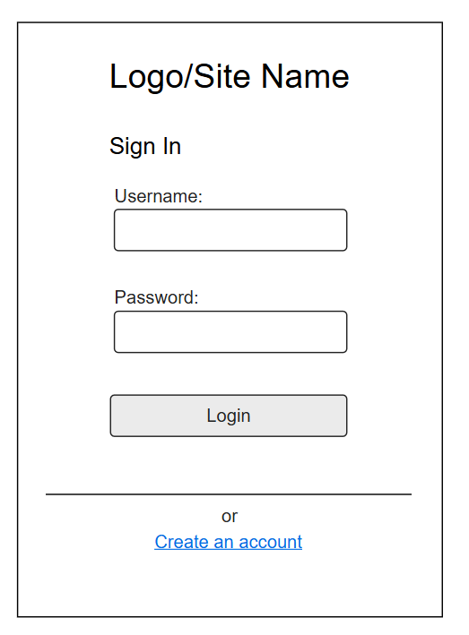
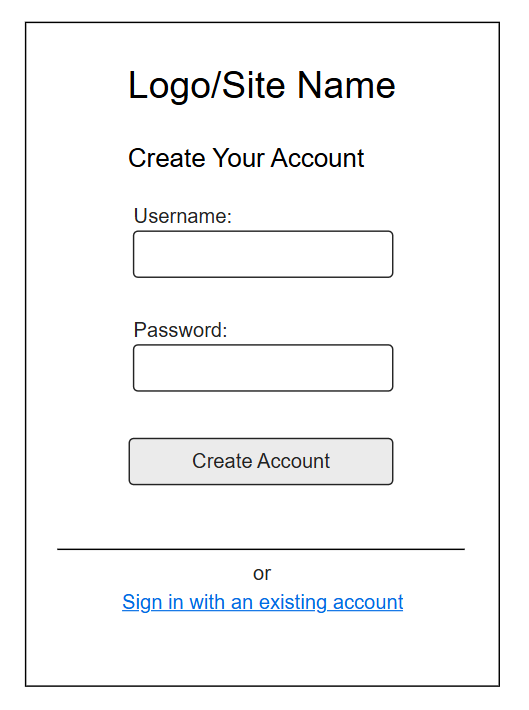
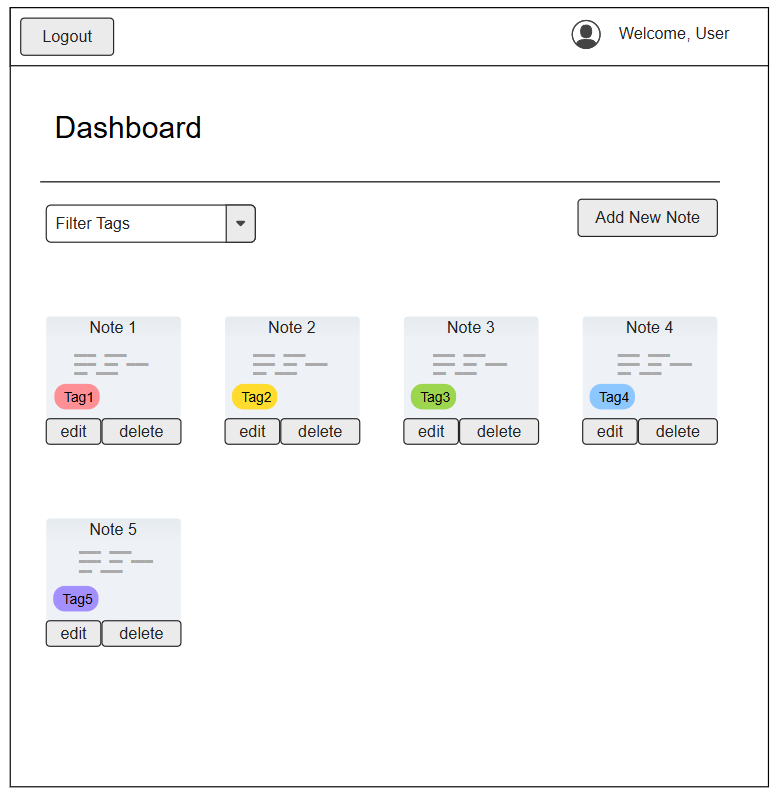
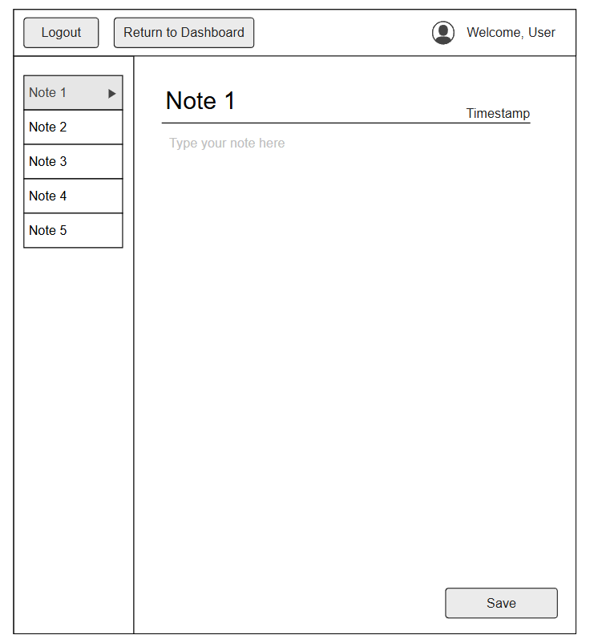

# CS408 Final Project

## Running
To run the project locally, install the Live Server extension for VScode. In the
command palette, select `Live Preview: Start Server`. Then, connect to
http://127.0.0.1:3000/ to view the running application.

## Testing
Tests can be viewed by first running the project locally, then navigating to
http://127.0.0.1:3000/test/test.html.

## Project Spec

For my final project, my plan is to create a note-taking application.

### Theme:

For the general theme, it will be a personalized digital notebook, which focuses on helping users organize and manage their notes. It will essentially be a CRUD application but for user notes. The app will include a simple plain text editor for users to write their notes. A login system will be implemented to ensure users have a personalized space, and there will be a dashboard where users can view, filter, and delete their notes. The plan is to stick with a minimalist design/style, so mainly focusing on functionality rather than making the app look pretty.

### Purpose/Functionality:

In terms of purpose and functionality, the app is simply intended for taking notes. Users will be able to create new notes, edit existing ones, and organize their notes with titles, tags (i.e. for different classes or topics), and timestamps. The app will support a search and filter system, allowing users to retrieve notes based on their tags or titles. Additionally, users can delete notes that are no longer needed.

### Target Audience:

The target audience for the application is mainly students, as they’re often required to write and organize notes for various classes and assignments. The inclusion of tags is intended to make it easier to categorize notes by subjects, classes or study topics. However, taking notes is such a general task that it automatically makes the application relevant to a wide variety of other audiences, from professionals to writers to just about anyone that needs to write things down.

### Managed Data:

At its core, the app will manage the notes themselves – storing the contents of each note, along with metadata such as titles, tags, timestamps, etc. Tags will be useful for organizing and categorizing notes, while timestamps will help users track when each note was created. In addition to managing notes, the application will also need to handle user data for authentication purposes. This will ensure that each user’s notes are securely stored and that users can only access their own notes, keeping user data separate.

### Stretch Goals:

There are several stretch goals I have in mind for the project. One of the key features I would like to implement is expanding the text editor functionality. Currently, the editor is only planned to support basic plain text, but I want to allow users to add additional formatting to their notes. This could include options for headings, bold and italic text, bullet points, numbered lists, etc. To achieve this, I would either implement a rich text editor or support markdown syntax. 

Another stretch goal involves adding support for in-line LaTeX rendering. This feature would allow users to type mathematical equations or expressions directly into their notes, and the application would render them properly on the page.

Finally, I would like to add a note-sharing feature, allowing users to share individual notes with others. This would be useful for collaborative projects, study groups, or sharing lecture notes between classmates. This could also include a live chatroom feature where users can collaborate in real time.

## Project Wireframe

## Sources

- https://docs.aws.amazon.com/AWSJavaScriptSDK/v3/latest/client/dynamodb/command/ScanCommand/
- https://docs.aws.amazon.com/amazondynamodb/latest/developerguide/GSI.html
- https://docs.aws.amazon.com/AWSJavaScriptSDK/v3/latest/client/dynamodb/command/QueryCommand/
- https://docs.aws.amazon.com/lambda/latest/dg/chapter-layers.html
- https://docs.aws.amazon.com/lambda/latest/dg/adding-layers.html
- https://developer.mozilla.org/en-US/docs/Web/API/Window/sessionStorage
- https://www.svgrepo.com/collection/zwicon-line-icons/